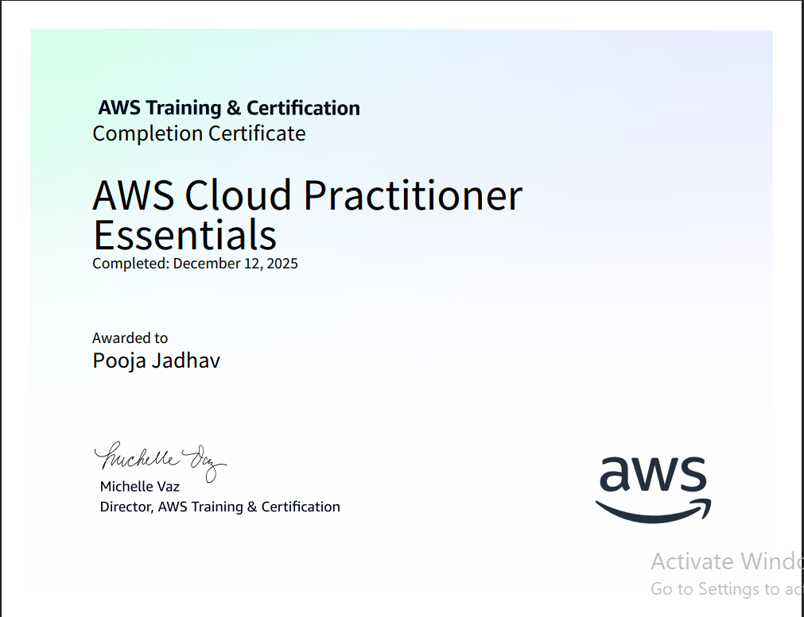

<!--
**iampooja-jadhav/iampooja-jadhav** is a ✨ _special_ ✨ repository because its `README.md` (this file) appears on your GitHub profile.

Here are some ideas to get you started:

- 🔭 I’m currently working on ...
- 🌱 I’m currently learning ...
- 👯 I’m looking to collaborate on ...
- 🤔 I’m looking for help with ...
- 💬 Ask me about ...
- 📫 How to reach me: ...
- 😄 Pronouns: ...
- ⚡ Fun fact: ...
-->
<h2>👋 Hello, I'm Pooja Jadhav</h2>

A Cloud and DevOps learner from India 🇮🇳, focused on understanding cloud
infrastructure, automation concepts, and modern DevOps practices.

---

### ☁️ Cloud & DevOps Focus
- Learning **AWS Cloud fundamentals**
- Understanding **DevOps culture & workflows**
- Working with **Docker containers**
- Exploring **Infrastructure as Code (Terraform)**
- Practicing **Linux administration basics**
- Using **Git & GitHub** for version control

---

##  Skills & Tools

| Domain | Tools |
|------|------|
| Cloud | AWS (EC2, S3, VPC, IAM, ALB) |
| Containers | Docker |
| IaC | Terraform |
| CI/CD | Jenkins, AWS CodePipeline |
| OS | Linux |
| Version Control | Git & GitHub |
| Scripting | Shell Scripting |

---

###  Career Goal
To start my journey in **Cloud & DevOps**, grow with hands-on experience,
and contribute to building scalable and automated systems.

---

## Certifications

### AWS Cloud Practitioner Essential

##  Connect With Me
- GitHub: https://github.com/poojajadhav
- LinkedIn: https://www.linkedin.com/in/pooja-jadhav-69135531b
- Medium: https://medium.com/@jadhavpooja87970
- Gmail: jadhavpooja87970@gmail.com
